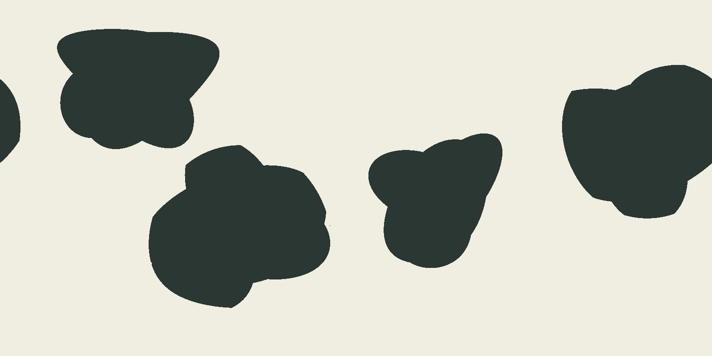
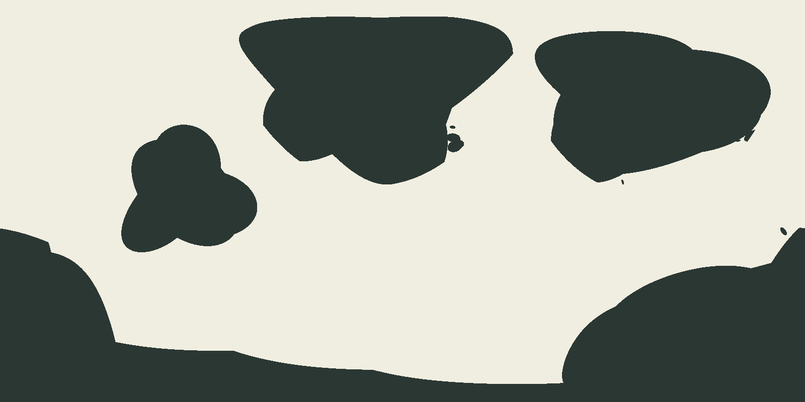
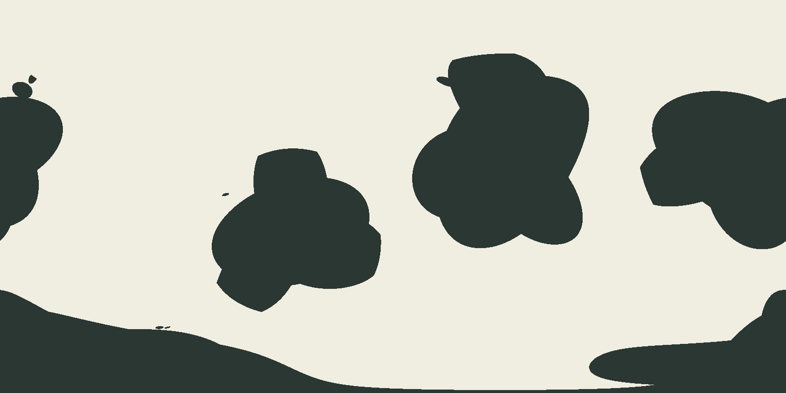
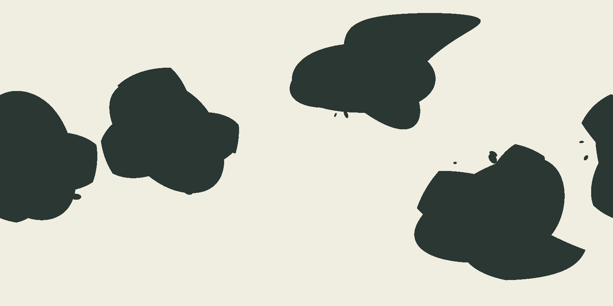
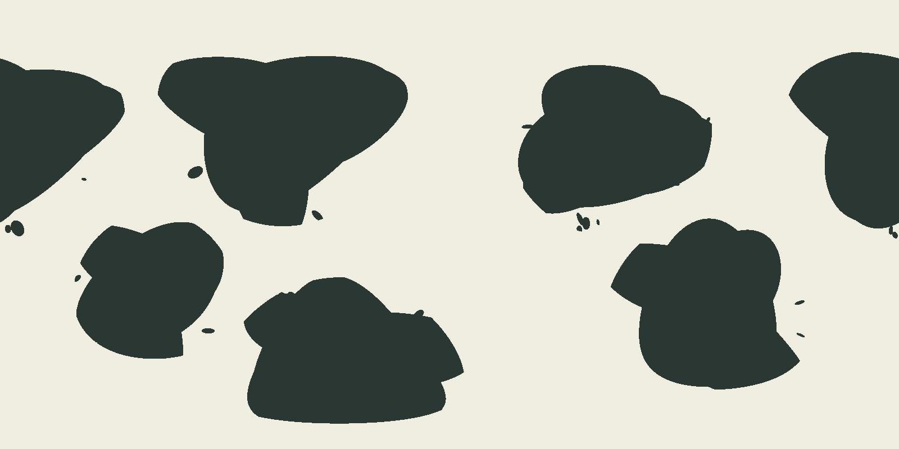

# Issue 164 — comparison visual review

Prototype revision: `issue-164-r2`. Dark fill is land. Each PNG is an unlabelled 1600 by 800
diagnostic image, not a production render or registered fixture. Exact inputs and SHA-256 values
are in [results.json](comparison/results.json). Review against [contract version 1](visual-contract.md).

## Review status

Assistant inspection: all twelve native-size images inspected, including the complete four-seed
default cohort of each family. Recommendation: **fail all twelve; select neither family**.
Human decisions: **all twelve fail**. On 2026-09-05 the maintainer explicitly answered,
“Fail all twelve; adopt the listed rationales,” after being presented this twelve-image matrix.
The table therefore records the adopted human decisions and rationales. This is visual rejection
of the prototypes, not approval to publish this investigation or accept an ADR.

| Row                                                                       | Assistant recommendation | Human decision | Rationale                                                                                                                                                                                            |
| ------------------------------------------------------------------------- | ------------------------ | -------------- | ---------------------------------------------------------------------------------------------------------------------------------------------------------------------------------------------------- |
| [envelope/normal-01](comparison/envelope-normal-01.png)                   | Fail                     | Fail           | Four broad owners remain rounded and interchangeable; the largest lower-left body has visibly clipped arcs. Lobes add scallops rather than a peninsula/embayment hierarchy.                          |
| [envelope/normal-02](comparison/envelope-normal-02.png)                   | Fail                     | Fail           | A smaller three-lobed western owner contrasts with two northern broad masses, but the northern and southern silhouettes still expose circular support clipping and smooth repeated lobes.            |
| [envelope/normal-03](comparison/envelope-normal-03.png)                   | Fail                     | Fail           | Broad bodies and open water are readable, but repeated three-lobe outlines and the flattened top of the central-western owner dominate; tiny marginal islands do not repair the hierarchy.           |
| [envelope/normal-04](comparison/envelope-normal-04.png)                   | Fail                     | Fail           | Orientation varies, but each owner reads as a clover or cookie. The southeastern body has a cut-off wedge; internal peninsula and bay hierarchy remains weak.                                        |
| [envelope/connected-majority](comparison/envelope-connected-majority.png) | Fail                     | Fail           | Six separated bodies preserve open water, but the central and eastern owners repeat round lobes with abrupt clipped corners. Similar spacing dominates the control case.                             |
| [envelope/fragmented-islands](comparison/envelope-fragmented-islands.png) | Fail                     | Fail           | Island groups cluster near margins and vary in size, an improvement on regular triplets. Broad bodies remain smooth rounded lobes, with a disproportionately weak peninsula/embayment hierarchy.     |
| [cellular/normal-01](comparison/cellular-normal-01.png)                   | Fail                     | Fail           | Three broad primary forms are distinguishable, but their straight/curved slab boundaries and the narrow central channel reveal the partition. Margin dots do not establish internal hierarchy.       |
| [cellular/normal-02](comparison/cellular-normal-02.png)                   | Fail                     | Fail           | Large northern and southern forms contrast in area with western fragments, but long uniform channels and polygonal shoulders dominate; projection stretches the polar bodies.                        |
| [cellular/normal-03](comparison/cellular-normal-03.png)                   | Fail                     | Fail           | The central body has a broad interior, but the detached pointed northern strip and geometric margins read as partition fragments rather than related continental lobes.                              |
| [cellular/normal-04](comparison/cellular-normal-04.png)                   | Fail                     | Fail           | A large western body and tapering eastern body provide area variation, yet long slab edges and the narrow western channel lack integrated bays and secondary lobes.                                  |
| [cellular/connected-majority](comparison/cellular-connected-majority.png) | Fail                     | Fail           | Several distinct components and intervening water remain visible. Wedge-shaped owners and long nearly constant-width channels make the cellular construction conspicuous.                            |
| [cellular/fragmented-islands](comparison/cellular-fragmented-islands.png) | Fail                     | Fail           | Three broad masses and irregular margin groups are positive. The upper-right owner remains a polygonal slab and the detached southern crescent reads as a cut fragment; macro hierarchy still fails. |

## Diversity assessment

Envelopes: area/orientation varies, but all four defaults repeat smooth lobed owners and exposed
circular bounds. The fragmented case improves island grouping without fixing those broad shapes.
Cellular: larger variation in component shares and continent extent, including near co-primary
bodies, but the entire default cohort repeats slabs, sharp shoulders, and narrow partition channels.
Neither control row rescues that grammar. Neither family passes by selecting its best seed.

## Images

Open an image for native-size inspection; compare each complete family at half size as well.

### normal-01

Envelope:

Cellular:

### normal-02

Envelope:

Cellular:

### normal-03

Envelope:

Cellular:

### normal-04

Envelope:

Cellular:

### connected-majority

Envelope:

Cellular:

### fragmented-islands

Envelope:

Cellular:

