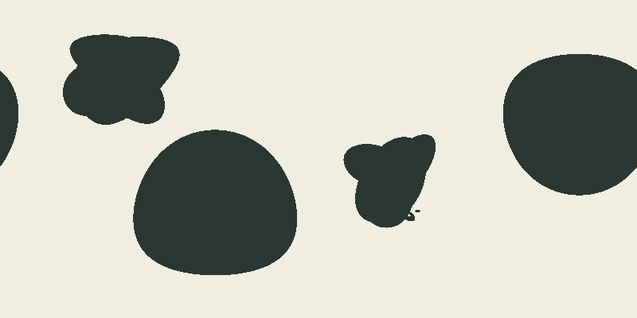
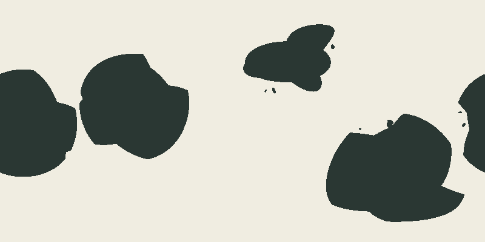
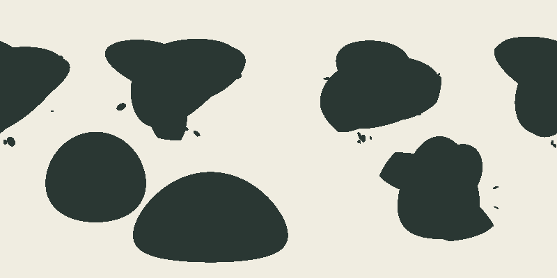

# Issue 165 — visual review of issue-165-r1

All twelve full-size images and all twelve 800-by-400 reads were inspected by the assistant.
Review against [issue-164 visual contract version 1](../issue-164/visual-contract.md).
Dark fill is land. PNGs contain no labels, overlays, strokes or silhouette repair.

**Assistant recommendation: fail all twelve; no selection. Human decisions: all twelve FAIL.**

The maintainer explicitly answered, “Fail all twelve; adopt the listed rationales,” after being
presented this revision and its per-row review on 2026-09-05. The human column
therefore records that decision and the adopted rationale in each row.
The observations below are assistant-authored and the rationales are now human-adopted. Primary counts are visual
judgments accounting for seam-connected pieces, not owner counts or semantic classification.

| Row                                                                          | Visually primary                       | Assistant | Human | Codes      | Positive observations, hierarchy and rationale                                                                                                                                                                                                              |
| ---------------------------------------------------------------------------- | -------------------------------------- | --------- | ----- | ---------- | ----------------------------------------------------------------------------------------------------------------------------------------------------------------------------------------------------------------------------------------------------------- |
| [envelope/normal-01](comparison-r1/envelope-normal-01.png)                   | 2                                      | Fail      | Fail  | R2, R3, R6 | Two broad primary interiors and two smaller bodies are readable. The primaries become almost featureless support caps; smaller bodies repeat clover lobes. No substantial peninsula/embayment hierarchy survives.                                           |
| [envelope/normal-02](comparison-r1/envelope-normal-02.png)                   | 3                                      | Fail      | Fail  | R2, R3, R6 | Three broad masses plus a smaller western body provide size hierarchy. Northern outlines expose clipped arcs and notches; the southern polar mass has little readable internal hierarchy. Polar projection width alone is not the rejection.                |
| [envelope/normal-03](comparison-r1/envelope-normal-03.png)                   | 3                                      | Fail      | Fail  | R2, R3, R6 | Broad interiors and a smaller seam-crossing body remain distinct. Repeated rounded lobes and abrupt shoulders dominate the central bodies; the polar body lacks a readable subordinate peninsula and bay.                                                   |
| [envelope/normal-04](comparison-r1/envelope-normal-04.png)                   | 3                                      | Fail      | Fail  | R2, R3, R4 | Three broad masses and a smaller northern body give clear size contrast. Arc clipping, circular bites, and the narrow western channel expose construction; the southeastern extension remains a repeated lobe.                                              |
| [envelope/connected-majority](comparison-r1/envelope-connected-majority.png) | 6 (control)                            | Fail      | Fail  | R2, R3, R4 | Six separated broad bodies and some irregular margin satellites are readable. Two near-circular southern/western caps and repeated northern lobes dominate; internal hierarchy is weak. Coverage also fails; the row name does not prove ocean semantics.   |
| [envelope/fragmented-islands](comparison-r1/envelope-fragmented-islands.png) | 3, plus secondary polar mass (control) | Fail      | Fail  | R2, R3, R6 | Unequal margin groups and broad interiors are positive. The western primary is a smooth cap and the central/eastern primaries repeat clover forms. More islands do not establish macro hierarchy; coverage also fails.                                      |
| [cellular/normal-01](comparison-r1/cellular-normal-01.png)                   | 2                                      | Fail      | Fail  | R3, R4, R6 | Two co-primary masses have broad interiors and a southwestern extension. Long flat/sloping edges, pointed shoulders and a narrow central partition channel remain conspicuous; smaller angular bodies lack integrated hierarchy.                            |
| [cellular/normal-02](comparison-r1/cellular-normal-02.png)                   | 3                                      | Fail      | Fail  | R3, R4     | Three large bodies and a smaller western form provide size contrast and broad water recesses. Long uniform northern channels and angular shoulders expose the partition. Polar stretching is acknowledged, not itself counted as a failing ribbon.          |
| [cellular/normal-03](comparison-r1/cellular-normal-03.png)                   | 3                                      | Fail      | Fail  | R3, R4     | The center-west and center-east forms have broad interiors and substantial recesses. Those recesses read as geometric punches with sharp ends; long slab edges and detached cut fragments remain. Area balance has not supplied varied subordinate anatomy. |
| [cellular/normal-04](comparison-r1/cellular-normal-04.png)                   | 3                                      | Fail      | Fail  | R1, R3, R4 | Three broad bodies and varied axes are positive. The northern secondary narrows into a blade, with long opposing channel edges; the southeastern body has sharp cut shoulders and weak peninsula hierarchy.                                                 |
| [cellular/connected-majority](comparison-r1/cellular-connected-majority.png) | 6 (control)                            | Fail      | Fail  | R1, R3, R4 | Six separated masses and unequal islands are readable. Wedges, slabs and the southeastern crescent dominate; near-uniform channels still reveal the partition. Ocean-connectivity semantics remain unverified.                                              |
| [cellular/fragmented-islands](comparison-r1/cellular-fragmented-islands.png) | 3 (control)                            | Fail      | Fail  | R3, R5, R6 | Three primary forms and varied islands are visible. The upper-right group floats far from its realized principal coast; pointed polygonal silhouettes and a detached southern crescent dominate instead of integrated hierarchy.                            |

## Default-seed diversity, separately from controls

Envelope defaults vary orientation, primary/minor sizes and polar placement, but repeat rounded
lobes and clipped support caps. The budgeting policy preserves clearer owner area hierarchy on
three defaults while worsening guard contact. None supplies the required hierarchy within each
primary; half-size inspection reaches the same conclusion.

Cellular defaults vary broad extent, recess direction and two-versus-three visually primary masses.
All retain slab/wedge margins and conspicuous channels; the third default's large recesses are a
positive shape feature but remain mechanically cut. Half-size reads retain these failures.

The connected-majority controls expose the balanced six-owner grammar rather than establish
ordinary-seed diversity or ocean-connectivity semantics. Fragmented controls add visible satellites,
but neither family fixes its failing macro outlines. No best-seed substitution is proposed.

## Fixed half-size reads with full-size links

### envelope/normal-01

[Full 1600 × 800](comparison-r1/envelope-normal-01.png)

### envelope/normal-02

[Full 1600 × 800](comparison-r1/envelope-normal-02.png)

### envelope/normal-03

[Full 1600 × 800](comparison-r1/envelope-normal-03.png)

### envelope/normal-04

[Full 1600 × 800](comparison-r1/envelope-normal-04.png)

### envelope/connected-majority

[Full 1600 × 800](comparison-r1/envelope-connected-majority.png)

### envelope/fragmented-islands

[Full 1600 × 800](comparison-r1/envelope-fragmented-islands.png)

### cellular/normal-01

[Full 1600 × 800](comparison-r1/cellular-normal-01.png)

### cellular/normal-02

[Full 1600 × 800](comparison-r1/cellular-normal-02.png)

### cellular/normal-03

[Full 1600 × 800](comparison-r1/cellular-normal-03.png)

### cellular/normal-04

[Full 1600 × 800](comparison-r1/cellular-normal-04.png)

### cellular/connected-majority

[Full 1600 × 800](comparison-r1/cellular-connected-majority.png)

### cellular/fragmented-islands

[Full 1600 × 800](comparison-r1/cellular-fragmented-islands.png)

