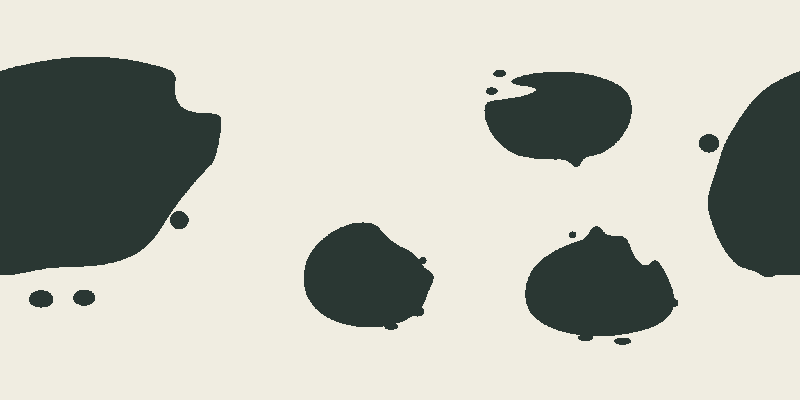
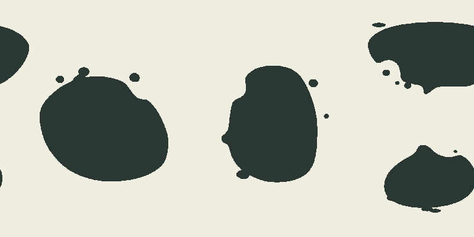
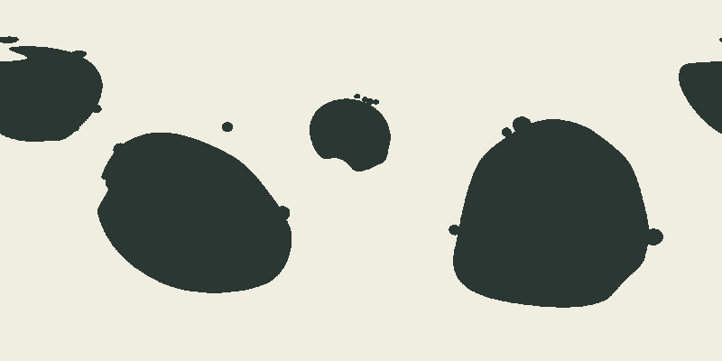
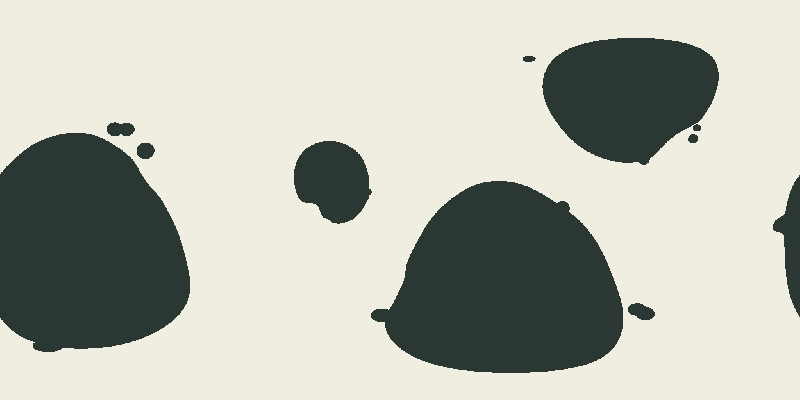
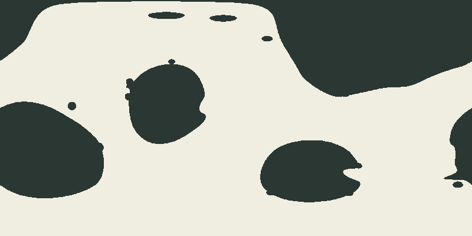

# Issue 191 — state 2 visual review

**Assistant judgment: FAIL all eighteen rows at both sizes. Maintainer decisions: pending.**

The implementing assistant inspected all 18 native 1600×800 images and all 18 retained 800×400
images individually. Review uses [issue 164 R1–R6](../issue-164/visual-contract.md). Dark is land.
Seam-connected pieces are one spherical body. A polar band is not rejected just for its projected
width. Primary counts below are visual judgments; the sampled area-rule counts are separately
retained in [the receipts](README.md#retained-row-receipts).

State 1 stopped on a harness error before retaining an image. It has no visual judgment, no
maintainer decision and no fabricated pass/fail. Its evidence remains immutable.

| Row                                                          | Visual primaries | Native assistant | Half assistant | R codes (both sizes) | Maintainer, verbatim | Observation at both sizes                                                                                                                                                                                                      |
| ------------------------------------------------------------ | ---------------: | ---------------- | -------------- | -------------------- | -------------------- | ------------------------------------------------------------------------------------------------------------------------------------------------------------------------------------------------------------------------------ |
| [normal-01](state-2/initial/normal-01.png)                   |                2 | Fail             | Fail           | R2, R3, R5, R6       | Pending              | The central primary is a nearly featureless oval; the seam body has one sharp notch and beadlike edge attachments. The southern polar band is projection-aware broad land, but supplies no readable subordinate anatomy.       |
| [normal-02](state-2/initial/normal-02.png)                   |                3 | Fail             | Fail           | R2, R3, R5, R6       | Pending              | The upper primary has a long simple envelope edge; the lower-left body is an oval with a single mouthlike incision. Nearby dots and attached bumps do not create lobe/peninsula hierarchy.                                     |
| [normal-03](state-2/initial/normal-03.png)                   |                1 | Fail             | Fail           | R2, R3, R5, R6       | Pending              | One large seam-crossing body and three smaller bodies have distinct area roles. The upper-right incision and lower-right rounded bite repeat the same simplified cut-blob grammar.                                             |
| [normal-04](state-2/initial/normal-04.png)                   |                3 | Fail             | Fail           | R2, R3, R5, R6       | Pending              | The central primary remains an unarticulated oval; the small western body is a bean. Polar breadth is projection distortion, but the outline still lacks a substantial peninsula and unequal lobes.                            |
| [connected-majority](state-2/initial/connected-majority.png) |                6 | Fail             | Fail           | R2, R3, R4, R5, R6   | Pending              | Six co-primary bodies communicate the balanced count control, yet repeated ovals, one-bite recesses and satellite dots form a regular spread. The southern projection does not independently prove ocean semantics.            |
| [fragmented-islands](state-2/initial/fragmented-islands.png) |                4 | Fail             | Fail           | R2, R3, R5, R6       | Pending              | The high-abundance control visibly adds groups along margins. Several groups become vertical bead strings, and the main bodies remain rounded with isolated cutouts; high fragmentation does not supply a new macro hierarchy. |
| [default-001](state-2/initial/default-001.png)               |                2 | Fail             | Fail           | R2, R3, R6           | Pending              | A large slanted southern oval contrasts with a polar primary and smaller beanlike bodies. The slant and size vary, but the interior-to-lobe and peninsula hierarchy is missing.                                                |
| [default-002](state-2/initial/default-002.png)               |                2 | Fail             | Fail           | R2, R3, R5, R6       | Pending              | The large western round body and upright eastern bean have different axes. Their tiny round attachments and shallow scoops leave both largely generic envelopes.                                                               |
| [default-003](state-2/initial/default-003.png)               |                2 | Fail             | Fail           | R2, R3, R6           | Pending              | A broad northern wedge and southern polar mass dominate two small notched disks. The long wedge edges and compact disks do not establish natural subordinate anatomy.                                                          |
| [default-004](state-2/initial/default-004.png)               |                4 | Fail             | Fail           | R2, R3, R5, R6       | Pending              | Four comparable bodies include two disks, an upper-right broad wedge and a southern polar body. Four visually co-primary masses also miss the ordinary one-to-three goal; repeated circular attachments remain.                |
| [default-005](state-2/initial/default-005.png)               |                2 | Fail             | Fail           | R2, R3, R5, R6       | Pending              | Two large southern ovals have broad interiors and different axes, but almost no outline-changing structure. The small upper body and edge buttons provide cosmetic detail.                                                     |
| [default-006](state-2/initial/default-006.png)               |                2 | Fail             | Fail           | R2, R3, R5, R6       | Pending              | A polar primary and seam oval dominate smaller bean and rounded triangular bodies. The triangular body has a single sharp mouth; the two-lobe and peninsula hierarchy is absent.                                               |
| [default-007](state-2/initial/default-007.png)               |                2 | Fail             | Fail           | R2, R3, R5, R6       | Pending              | Two polar-reaching bodies frame a central disk and rounded triangle. Wide ocean space is coherent, but an isolated polar notch and dotted margins leave the simple body grammar intact.                                        |
| [default-008](state-2/initial/default-008.png)               |                2 | Fail             | Fail           | R2, R3, R5, R6       | Pending              | Large western and southern rounded triangles contrast with a small central bean. These are visibly different from default-005 ovals, yet long unarticulated margins and attached buttons remain engineered.                    |
| [default-009](state-2/initial/default-009.png)               |                1 | Fail             | Fail           | R2, R3, R6           | Pending              | The southern polar-reaching main body has one isolated west-side bite; northern and side bodies remain broad simple envelopes. Projection stretch itself is not scored as a ribbon.                                            |
| [default-010](state-2/initial/default-010.png)               |                2 | Fail             | Fail           | R2, R3, R5, R6       | Pending              | The large northern/seam body and southern rounded wedge have different scale and orientation. Nearly straight sloping margins, isolated cuts and paired buttons replace varied subordinate anatomy.                            |
| [default-011](state-2/initial/default-011.png)               |                3 | Fail             | Fail           | R2, R3, R5, R6       | Pending              | The central primary has a mouthlike cut opposite rounded attachments. The northern and seam bodies repeat smooth broad envelopes; polar islands stretch in projection but do not repair hierarchy.                             |
| [default-012](state-2/initial/default-012.png)               |                3 | Fail             | Fail           | R2, R3, R5, R6       | Pending              | The southern oval has a conspicuous mouth-shaped excavation; central and seam bodies carry small round protrusions. The northern primary adds area, not readable lobes and a substantial peninsula.                            |

## Default-seed diversity

The twelve default worlds are not literal rotations of shared template bodies: compare the
slanted oval in default-001, the upright bean in default-002, the large wedge in default-003,
the paired southern ovals in default-005, and the broad rounded triangles in default-008.
Layout, size ratios, facing recesses and polar realization vary. This is seed-dependent geometric
variation, supported by the retained owner parameters as well as the images.

**The intended visually diverse organic silhouettes are nevertheless not demonstrated.** Nearly
every main body still reads as an anisotropic blob with one bite and small buttons. The changes
in outline and arrangement do not produce varied internal hierarchy. All twelve fail R2/R6 at
half size as well as native size; several also expose R3/R5. R1 is not needed to explain these
failures. R4 is applied to the balanced six-body control, not generalized to every arrangement.

The fragmented control adds margin groups, but the groups frequently read as beads. This is a
visible abundance response and an unsuccessful morphology outcome. No ocean semantic result is
claimed by the connected-majority filename or the production threshold proxy.

## Maintainer decision request

Please review the images below and give a PASS/FAIL decision for each row, with any corrections
to the observations. A single explicit decision applying to all eighteen rows can be recorded
verbatim in every row. No response is not acceptance. The issue cannot be closed from assistant
judgment. This request and the eventual verbatim decisions are prepared locally; no GitHub comment
has been posted from this task.

## Fixed image gallery

Each embedded image is the retained 800×400 version; the linked native image is 1600×800.

### normal-01

[Native image](state-2/initial/normal-01.png)

### normal-02

[Native image](state-2/initial/normal-02.png)

### normal-03

[Native image](state-2/initial/normal-03.png)

### normal-04

[Native image](state-2/initial/normal-04.png)

### connected-majority

[Native image](state-2/initial/connected-majority.png)

### fragmented-islands

[Native image](state-2/initial/fragmented-islands.png)

### default-001

[Native image](state-2/initial/default-001.png)

### default-002

[Native image](state-2/initial/default-002.png)

### default-003

[Native image](state-2/initial/default-003.png)

### default-004

[Native image](state-2/initial/default-004.png)

### default-005

[Native image](state-2/initial/default-005.png)

### default-006

[Native image](state-2/initial/default-006.png)

### default-007

[Native image](state-2/initial/default-007.png)

### default-008

[Native image](state-2/initial/default-008.png)

### default-009

[Native image](state-2/initial/default-009.png)

### default-010

[Native image](state-2/initial/default-010.png)

### default-011

[Native image](state-2/initial/default-011.png)

### default-012

[Native image](state-2/initial/default-012.png)

